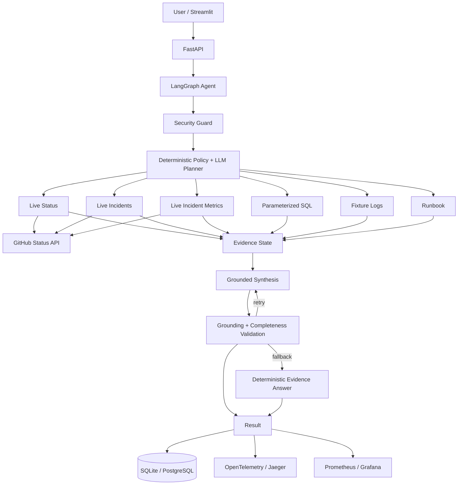

# AgentOps Local — Live Incident Investigation Agent

AgentOps Local is a **local-first, zero-paid-API AI incident investigation system**. It combines a local Ollama model with LangGraph orchestration, real public GitHub Status evidence, deterministic safety/grounding controls, persistence, MCP, observability, CI, Docker, and local Kubernetes assets.

The portfolio/demo path fetches live data at runtime from:

- `https://www.githubstatus.com/api/v2/summary.json`
- `https://www.githubstatus.com/api/v2/incidents.json`

Local checkout metrics/logs/orders remain only as deterministic regression fixtures. They are explicitly separated from the live portfolio path.


## What is implemented

### Agent engineering

- LangGraph state machine and multi-tool loop
- Pydantic structured planner output
- deterministic minimal-tool policy before LLM planning
- safe structured tool registry and input validation
- transient tool retries + deterministic recovery/replan pass
- read-only permission model with a future-write human-approval branch
- source provenance (`source`, `source_url`, `fetched_at`)
- grounded synthesis with deterministic validation
- broader unsupported numeric/source claim checks
- answer completeness checks
- answer retry + deterministic evidence fallback
- human-review flag when evidence/tool state remains unsafe

### Real + local tools

- `status` — current GitHub service/component health
- `incidents` — recent GitHub incidents and official updates
- `incident_metrics` — runtime-derived public incident analytics
- `sql` — parameterized read-only local fixture queries, filters, IDs, and counts
- `logs` — deterministic local incident-log search
- `metrics` — deterministic fixture metrics
- `knowledge` — local runbook retrieval

### Production-style layers

- FastAPI structured request/response models
- persisted investigations, tool traces, evaluation runs, and sessions
- Streamlit portfolio UI with plan, evidence, trace, retries, validation, and observability
- MCP Python SDK server/client + tool discovery + full-investigation trace demo
- Ollama-native function-calling comparison implementation
- Prometheus metrics
- OpenTelemetry custom spans + FastAPI tracing
- local Jaeger trace visualization
- provisioned Grafana dashboard
- PostgreSQL via Docker Compose
- pytest + Ruff + deterministic offline evaluation
- GitHub Actions tests/lint/policy evaluation + Docker build checks
- kind/Minikube-ready Kubernetes manifests and demo automation

## Verified real-data baseline

A live run on 2026-09-22 verified the existing live-data core with:

- `21 passed`
- `All checks passed!`
- GitHub Status source reachable
- current status: `All Systems Operational`
- latest incident correctly retrieved as `Incident with Pull Requests`
- latest-incident plan: `incidents` only
- `answer_valid=True`
- `requires_human_review=False`


The final tracker-completion bundle adds further persistence, security, retry/recovery, observability, CI, Kubernetes, and portfolio tests/assets. Run `scripts/finalize.ps1` once on the target laptop to verify every machine-dependent integration in the final bundle.

## Architecture



More detail: [`docs/architecture.md`](docs/architecture.md) and [`docs/agent-flow.md`](docs/agent-flow.md).

## One-command final verification

From PowerShell inside the project with `.venv` active:

```powershell
.\scripts\finalize.ps1
```

The finalizer runs the expanded tests/lint/offline policy evaluation, checks the real GitHub Status source, smoke-tests FastAPI and Streamlit, imports the MCP server, builds Docker images when Docker is installed, validates Kubernetes manifests when `kubectl`/kind are installed, and writes:

```text
reports/final_validation.json
```

## Manual commands

### Core quality

```powershell
pytest -q
ruff check backend tests frontend
python -m backend.evaluation.run_policy_evaluation
```

### Real source

```powershell
python -m backend.evaluation.run_live_source_check
```

### Full local LLM agent

```powershell
python -m backend.agent.graph
```

### FastAPI

```powershell
uvicorn backend.main:app --reload
```

Open `http://127.0.0.1:8000/docs`.

Key endpoints:

- `POST /investigate`
- `GET /public-status`
- `GET /public-incidents`
- `GET /public-incident-metrics`
- `GET /source-health`
- `GET /investigations`
- `GET /sessions/{session_id}`
- `GET /evaluations`
- `GET /metrics`
- `GET /health`

### Streamlit

```powershell
streamlit run frontend/app.py
```

Open `http://localhost:8501`.

### MCP

```powershell
$env:MCP_TRANSPORT="streamable-http"
$env:MCP_PORT="8001"
python -m backend.mcp_server
```

Then in another terminal:

```powershell
python -m backend.mcp_client_demo
```

### Native Ollama function-calling comparison

```powershell
python -m backend.native_tool_calling
```

### Docker

```powershell
docker compose up --build
```

Optional local observability (enables OTLP export from the backend to Jaeger):

```powershell
$env:OTEL_EXPORTER_OTLP_ENDPOINT="http://jaeger:4317"; docker compose --profile observability up --build
```

Optional MCP container:

```powershell
docker compose --profile mcp up --build
```

Ports:

- FastAPI `8000`
- Streamlit `8501`
- MCP `8001`
- Prometheus `9090`
- Grafana `3000`
- Jaeger `16686`

### Kubernetes

```powershell
.\scripts\k8s_demo.ps1
```

See [`docs/kubernetes.md`](docs/kubernetes.md).

## Observability

Each result includes an `observability_summary` with:

- investigation ID
- planner/answer/total latency
- tool execution/error/retry counts
- average/max tool latency
- LLM call count
- model name(s)
- prompt/completion token counts when Ollama reports them
- prompt versions
- recovery and validation state

Prometheus and OpenTelemetry expose the same operational signals for Grafana/Jaeger. See [`docs/observability.md`](docs/observability.md).


## Evaluation strategy

Offline CI stays deterministic and does **not** depend on GitHub Status or Ollama availability. Real-source checks are separate. The full local-LLM evaluation can persist reports when run locally.

See [`docs/evaluation.md`](docs/evaluation.md).

## Safety

All enabled external-facing tools are read-only. Unknown tools are rejected. Tool inputs are centrally validated. Direct system/tool-policy bypass instructions are blocked by a narrow preflight guard. A human-approval branch exists for any future tool registered as `write`.

See [`docs/security.md`](docs/security.md).

## Cost and deliberate architecture decisions

The portfolio path uses no paid API. Ollama, LangGraph, FastAPI, MCP, PostgreSQL, Prometheus, Grafana, Jaeger/OpenTelemetry, Streamlit, Docker, and kind are local/open-source components.

`pgvector` and Redis are intentionally **not** added because the current system has no vector-retrieval or caching requirement. Adding them only for keywords would make the architecture less credible. Their applicability was evaluated and documented in [`docs/future-work.md`](docs/future-work.md).

## Portfolio material

- Demo scenarios: [`docs/demo.md`](docs/demo.md)
- Failure/recovery: [`docs/failure-recovery.md`](docs/failure-recovery.md)
- Limitations: [`docs/limitations.md`](docs/limitations.md)
- Future work: [`docs/future-work.md`](docs/future-work.md)
- Resume bullets: [`docs/resume-bullets.md`](docs/resume-bullets.md)
- Native tool-calling comparison: [`docs/native-tool-calling.md`](docs/native-tool-calling.md)
- Tracker completion matrix: [`docs/tracker-completion.md`](docs/tracker-completion.md)

## Resume-ready summary

> Built a local-first LangGraph incident-investigation agent that ingests real public GitHub Status incidents and component health at runtime, computes incident analytics, plans minimal read-only tool calls, retries/recoveries transient failures, validates grounded and complete answers, records source/tool/LLM traces, persists investigations and evaluations, and ships through FastAPI, Streamlit, MCP, PostgreSQL, Prometheus/OpenTelemetry, Docker Compose, CI, and local Kubernetes — without paid APIs.
