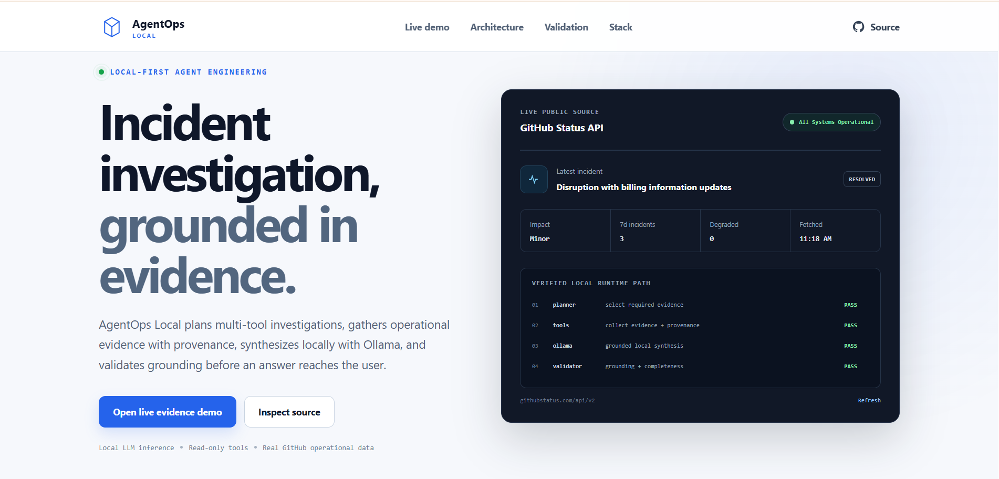
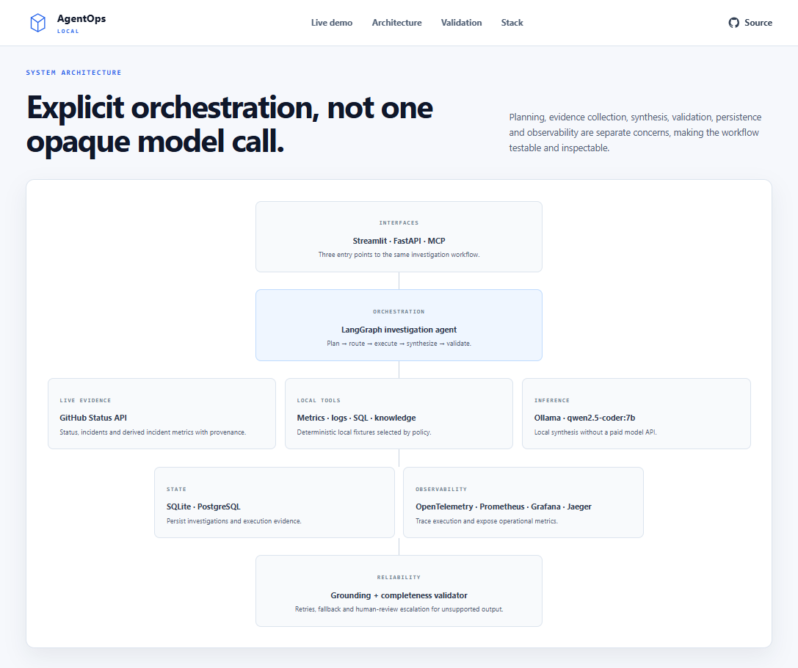
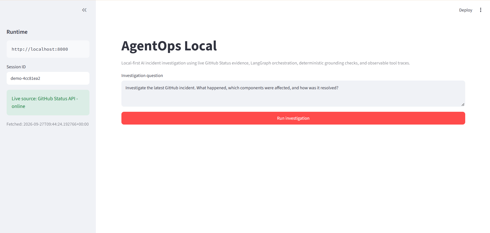
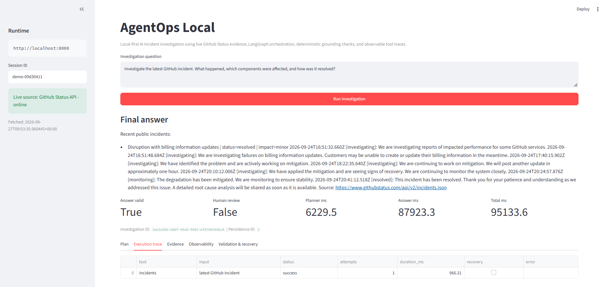
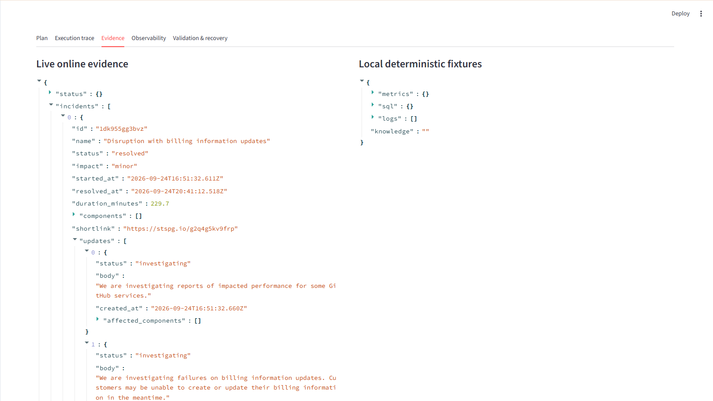
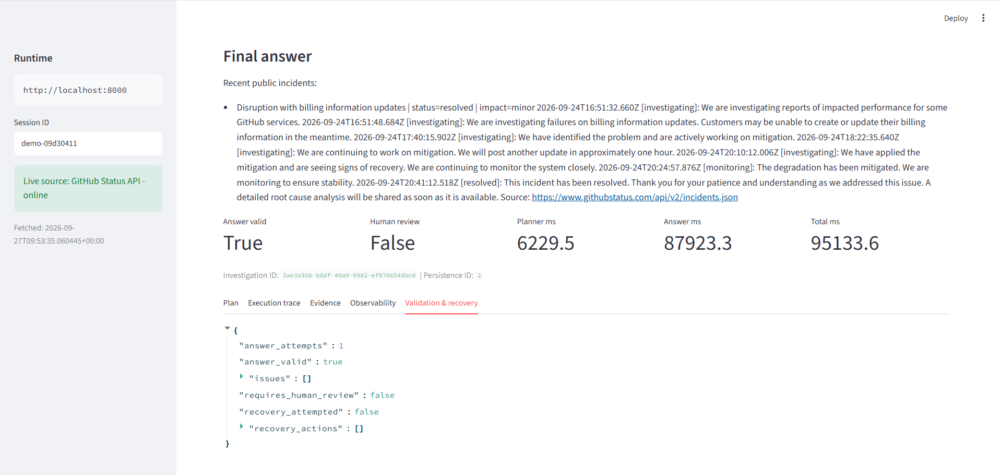
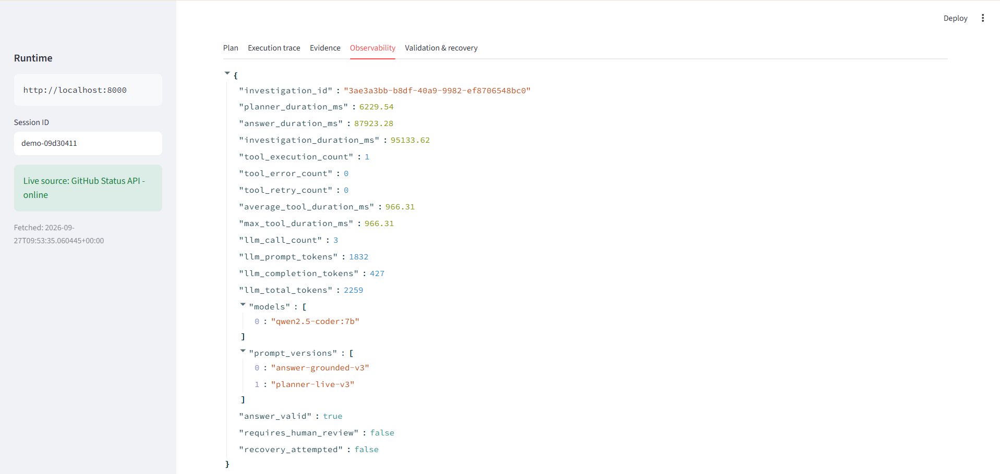
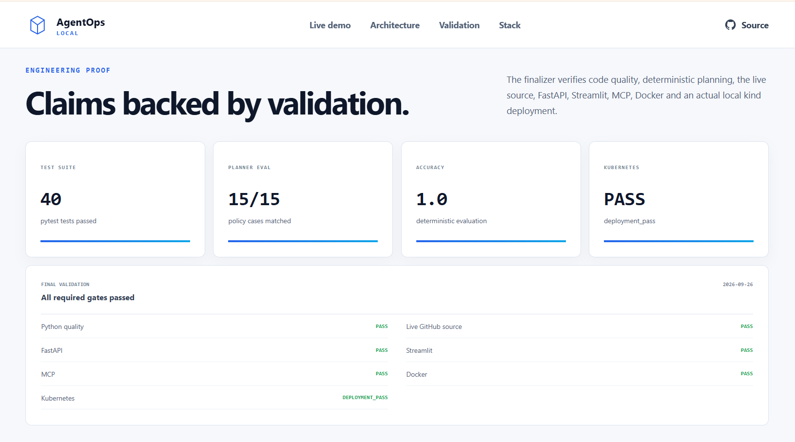

# AgentOps Local

**Local-first AI incident investigation, grounded in evidence.**

AgentOps Local is a production-style portfolio system for investigating real public GitHub service incidents. It uses LangGraph to plan read-only tool calls, the GitHub Status API as the primary live evidence source, Ollama (`qwen2.5-coder:7b`) for local synthesis, and deterministic validation before returning an answer.

No paid model API is required.

<p align="center">
  
</p>

**Stack:** LangGraph · Ollama · FastAPI · Streamlit · MCP · SQLite/PostgreSQL · OpenTelemetry · Prometheus · Grafana · Jaeger · Docker · kind/Kubernetes · GitHub Actions

> **Scope:** this is a production-style **local** portfolio system, not a cloud-hosted production service. The static site under `docs/` can be published with GitHub Pages; the full LangGraph + Ollama runtime remains local.

## What the system demonstrates

- **Live evidence ingestion** from the public GitHub Status API
- **Structured agent orchestration** with LangGraph, Pydantic plans, minimal tool selection, retries and recovery
- **Grounded local synthesis** with Ollama rather than a paid cloud LLM API
- **Deterministic validation** for grounding, identifiers, unsupported numeric/source claims and answer completeness
- **Read-only tool safety** with centralized schemas, permissions and input validation
- **Persistence** for investigations, tool traces, sessions and evaluations using SQLite or PostgreSQL
- **Multiple interfaces** through FastAPI, Streamlit and MCP
- **Observability** with investigation/tool/LLM timings, token metadata, Prometheus metrics and OpenTelemetry traces
- **Deployment assets** for Docker Compose and local kind/Kubernetes
- **Deterministic evaluation** plus a separate live-source verification path

## How an investigation works

1. A user asks an operational question.
2. A security preflight checks for direct prompt/tool-policy bypass patterns.
3. A deterministic policy selects the minimum known tools for common intents; the LLM planner is used where structured planning is needed.
4. LangGraph executes the plan, records tool status/timing and retries transient failures.
5. Evidence is accumulated with provenance such as `source`, `source_url` and `fetched_at`.
6. Local Ollama synthesizes an answer from the collected evidence.
7. A deterministic validator checks grounding and completeness.
8. Invalid output can be regenerated; unresolved cases use deterministic fallback and/or a human-review flag.
9. Investigation, execution trace and observability data are persisted and exposed through the interfaces.

<p align="center">
  
</p>

More detail: [`docs/architecture.md`](docs/architecture.md) · [`docs/agent-flow.md`](docs/agent-flow.md)

## Real investigation walkthrough

The portfolio path queries the real public GitHub Status API at runtime. Local checkout logs, metrics, SQL data and runbook content are kept only as deterministic regression fixtures and are presented separately from live evidence.

**1. Ask a real incident question**

<p align="center">
  
</p>

**2. Inspect the tool execution trace**

<p align="center">
  
</p>

**3. Review the live evidence separately from local fixtures**

<p align="center">
  
</p>

**4. Validate the final grounded answer**

<p align="center">
  
</p>

## Observability

Each investigation exposes an `observability_summary` with planner, answer and total latency; tool execution/error/retry counts; LLM call count; model name; prompt/completion token counts when available; prompt versions; and validation/recovery state.

<p align="center">
  
</p>

Prometheus and OpenTelemetry provide the platform-level metrics/traces used by Grafana and Jaeger. See [`docs/observability.md`](docs/observability.md).

## Verified engineering proof

Latest verified local validation includes:

| Check | Verified result |
|---|---:|
| pytest | **40 passed** |
| Ruff | **pass** |
| deterministic planner-policy cases | **15 / 15** |
| planner-policy accuracy | **1.0** |
| live GitHub Status source | **pass** |
| FastAPI smoke test | **pass** |
| Streamlit smoke test | **pass** |
| MCP smoke test | **pass** |
| Docker verification | **pass** |
| local kind/Kubernetes deployment | **deployment pass** |

Machine-level verification output is committed in [`reports/final_validation.json`](reports/final_validation.json), and the deterministic policy evaluation is committed in [`reports/policy_evaluation.json`](reports/policy_evaluation.json).

<p align="center">
  
</p>

## Live and deterministic tools

### Primary live tools

- `status` — current GitHub health, components and unresolved incidents
- `incidents` — recent GitHub incidents, timestamps and official updates
- `incident_metrics` — runtime-derived counts, severity and resolution-time metrics

Primary source:

- `https://www.githubstatus.com/api/v2/summary.json`
- `https://www.githubstatus.com/api/v2/incidents.json`

### Local deterministic fixtures

- `metrics` — checkout metrics fixture
- `sql` — parameterized read-only SQLite fixture queries
- `logs` — deterministic checkout incident-log search
- `knowledge` — local payment incident runbook

These fixtures exist for deterministic tests, failure simulation, grounding regression and tool-selection evaluation. They are **not** presented as live production evidence.

## Key implementation areas

| Area | Implementation |
|---|---|
| Agent orchestration | LangGraph state machine, structured planner, minimal tool policy, multi-step loop |
| LLM | Local Ollama with `qwen2.5-coder:7b` |
| Grounding | evidence-only synthesis, numeric/source/identifier checks, completeness validation |
| Reliability | planner/tool retries, failed-tool handling, answer retry, deterministic fallback |
| Safety | read-only allowlist, structured inputs, abuse guard, future-write approval branch |
| Persistence | SQLite locally; PostgreSQL through Docker Compose |
| Interfaces | FastAPI, Streamlit, MCP v2 |
| Observability | local summary, Prometheus, OpenTelemetry, Grafana, Jaeger |
| Delivery | pytest, Ruff, deterministic evaluation, GitHub Actions, Docker, kind/Kubernetes |

## Run locally

### Prerequisites

- Python 3.11+
- Ollama
- Docker Desktop only if you want the containerized/PostgreSQL/observability/Kubernetes paths

### Setup

```powershell
python -m venv .venv
.\.venv\Scripts\Activate.ps1
pip install -r requirements-dev.txt
Copy-Item .env.example .env
ollama pull qwen2.5-coder:7b
```

### Start the API

```powershell
uvicorn backend.main:app --reload
```

FastAPI docs: `http://127.0.0.1:8000/docs`

### Start the Streamlit UI

In another terminal:

```powershell
streamlit run frontend/app.py
```

UI: `http://localhost:8501`

### Docker Compose

```powershell
docker compose up --build
```

### Final local verification

```powershell
.\scripts\finalize.ps1
```

The finalizer runs quality checks, deterministic policy evaluation, live-source verification, interface smoke tests and available local deployment checks.

## Repository map

```text
backend/
  agent/               LangGraph state, planning, execution, synthesis, validation
  tools/               GitHub Status tools + deterministic local fixtures
  evaluation/          policy, live-source and full-agent evaluation
  main.py              FastAPI application
  mcp_server.py        MCP server
  persistence.py       SQLite/PostgreSQL persistence
  observability.py     Prometheus/OpenTelemetry instrumentation

frontend/
  app.py               Streamlit investigation UI

observability/         Prometheus + Grafana configuration
k8s/                   local Kubernetes manifests
scripts/               final validation and kind demo automation
tests/                 unit/regression/security/API/observability tests
docs/                  architecture, evaluation, screenshots and static showcase
reports/               committed validation/evaluation summaries
```

## Documentation

- [Architecture](docs/architecture.md)
- [Agent flow](docs/agent-flow.md)
- [Evaluation](docs/evaluation.md)
- [Failure and recovery](docs/failure-recovery.md)
- [Observability](docs/observability.md)
- [Security](docs/security.md)
- [Kubernetes](docs/kubernetes.md)
- [Demo scenarios](docs/demo.md)
- [Limitations](docs/limitations.md)
- [Future work](docs/future-work.md)
- [Native Ollama tool-calling comparison](docs/native-tool-calling.md)
- [Tracker completion matrix](docs/tracker-completion.md)

## Deliberate scope decisions

- **No paid API:** the main LLM path runs locally through Ollama.
- **Read-only runtime:** no write-capable operational tool is currently enabled.
- **No production-cloud claim:** Docker and Kubernetes are verified as local deployment paths.
- **No unnecessary vector database:** `pgvector` is intentionally excluded because the current workflow has no vector-retrieval requirement.
- **No unnecessary Redis layer:** Redis is intentionally excluded because there is no measured caching/concurrency requirement and caching would make live/evaluation behavior less transparent.

## Project purpose

AgentOps Local was built to demonstrate practical agent engineering beyond a chat interface: **real evidence retrieval, controlled tool use, transparent execution traces, grounded answer generation, deterministic validation, observability, persistence and deployable system boundaries** in one local-first project.
