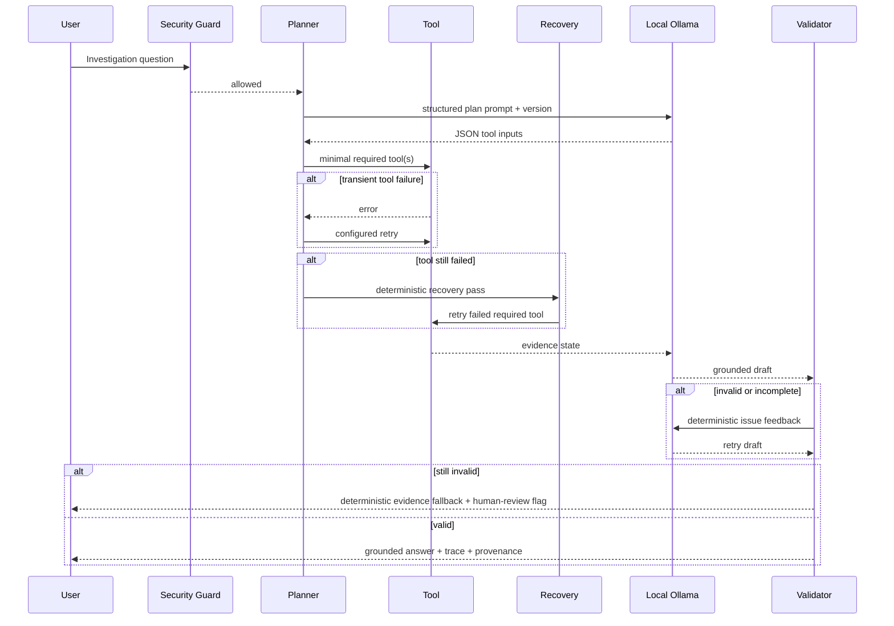

# Agent flow

```mermaid
sequenceDiagram
    participant User
    participant Guard as Security Guard
    participant Planner
    participant Tool
    participant Recovery
    participant LLM as Local Ollama
    participant Validator

    User->>Guard: Investigation question
    Guard-->>Planner: allowed
    Planner->>LLM: structured plan prompt + version
    LLM-->>Planner: JSON tool inputs
    Planner->>Tool: minimal required tool(s)
    alt transient tool failure
        Tool-->>Planner: error
        Planner->>Tool: configured retry
    end
    alt tool still failed
        Planner->>Recovery: deterministic recovery pass
        Recovery->>Tool: retry failed required tool
    end
    Tool-->>LLM: evidence state
    LLM-->>Validator: grounded draft
    alt invalid or incomplete
        Validator->>LLM: deterministic issue feedback
        LLM-->>Validator: retry draft
    end
    alt still invalid
        Validator-->>User: deterministic evidence fallback + human-review flag
    else valid
        Validator-->>User: grounded answer + trace + provenance
    end
```
