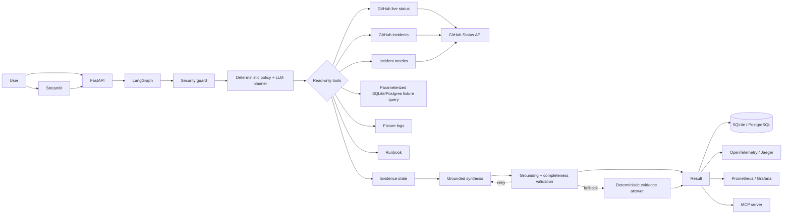

# Architecture

## Design principles

1. **Live data for the portfolio path.** GitHub Status incidents and component state are fetched at runtime.
2. **Deterministic control around the LLM.** Tool minimality, permissions, validation, retries, and fallback are deterministic.
3. **Read-only by default.** Current tools cannot mutate external systems. A human-approval gate exists for any future write tool.
4. **Traceable evidence.** Public evidence carries `source`, `source_url`, and `fetched_at` metadata.
5. **Local-first and zero paid API.** Ollama runs locally; infrastructure is open source and self-hosted.
